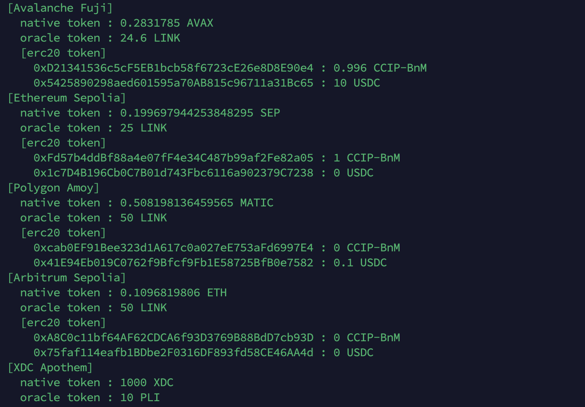

# ccipMultiChainTool
chainLinkのCCIPを検証するために、各ネットワークを横断して処理するためのサポートツール<br>
将来的にPluginに実装されるCCIPの検証を想定したツール<br>
前提としてnpmがインストールされていること<br>
ブロックチェーンとの対話はweb3.jsを使用

# リポジトリ
```
git clone https://github.com/AoiToSouma/ccipMultiChainTool.git
cd ccipMultiChainTool
npm install
```

# 環境設定
```
nano config.json
```
必要なパラメータはconfig.jsonにまとめて記載<br>
<br>
privatekey : EOA(Wallet Address)のPRIVATE KEY ※自身のwallet addressのPRIVATE KEYを記載すること<br>
chain : CCIPが対応するチェーン情報 デフォルトでOracleとERC20トークンのCCIP-BnM, USDCを参照できるように定義済み<br>
abi : OracleおよびERC20トークンの残高を照会するためのABI情報<br>

# 実行
残高照会
```
node balanceCheck.js
```


